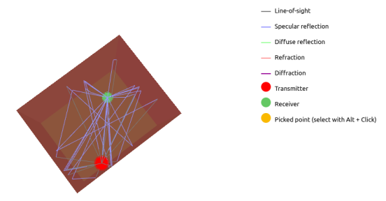

# Ray-tracing project
This is a project made during our Erasmus exchange semester at TU Wien. It generates a room with a transmitter/receiver pair and uses the `sionna-rt` python package to gather data regarding the transmitted rays in order to compute both the power delay profile and the power angular spectrum.

The specific materials used for creating the room, as well as its size and the position of the transmitter and receiver are all generated randomly within a range specified in the code. After collecting the data provided by Sionna and performing some computations, it organizes the data in a .json file created after running the program. This process is repeated inside of a for loop which runs for as many iterations as is specified by the user.

Example of a generated room: 

